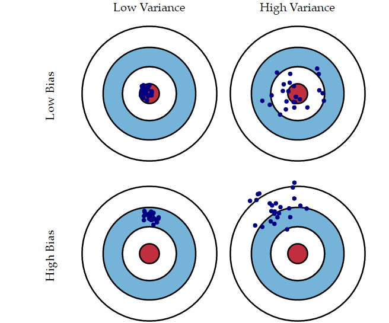
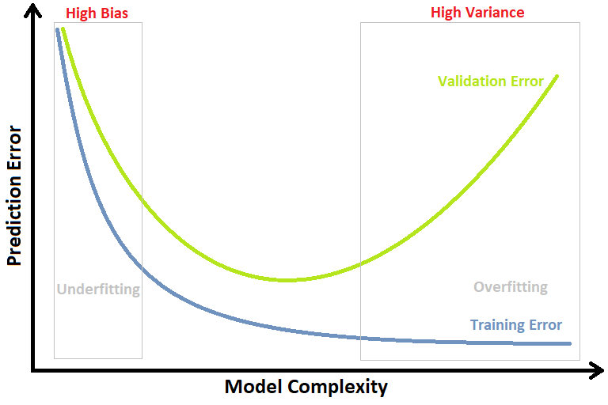
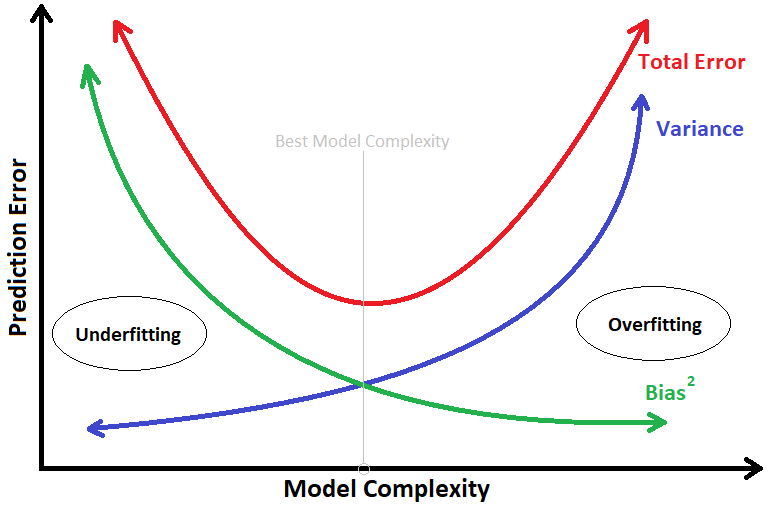

# The Bias/Variance Trade-off

An important theoretical result of statistics and ML is the fact **a model's generalization error can be expressed as the sum of 3 very different errors**:

## :one: Error 1: Bias

This part of the generalization error is **due to wrong assumptions**, such as assuming that the data is linear when it's actually quadratic.

**A high-bias model is most likely to underfit the training data.**

## :two: Error 2: Variance

This part is **due to the model's excessive** (过高的/过分的) **sensitivity to small variations in the training data**.

**A model with many degree of freedom (such as high-degree polynomial model) is likely to have high variance and thus overfit the training data.**

## :three: Error 3: Irreducible error

This part is **due to the noisiness of the data itself**.

The **only way to reduce this error is to clean up the data.** Like:

-   Fix the data sources, such as broken sensors;
-   Detect and remove outliers.

## :warning: ​Trade off

-   Increasing a model's complexity will typically increase its variance and reduce its bias;
-   Reducing a model's complexity increases its bias and reduces its variance.

